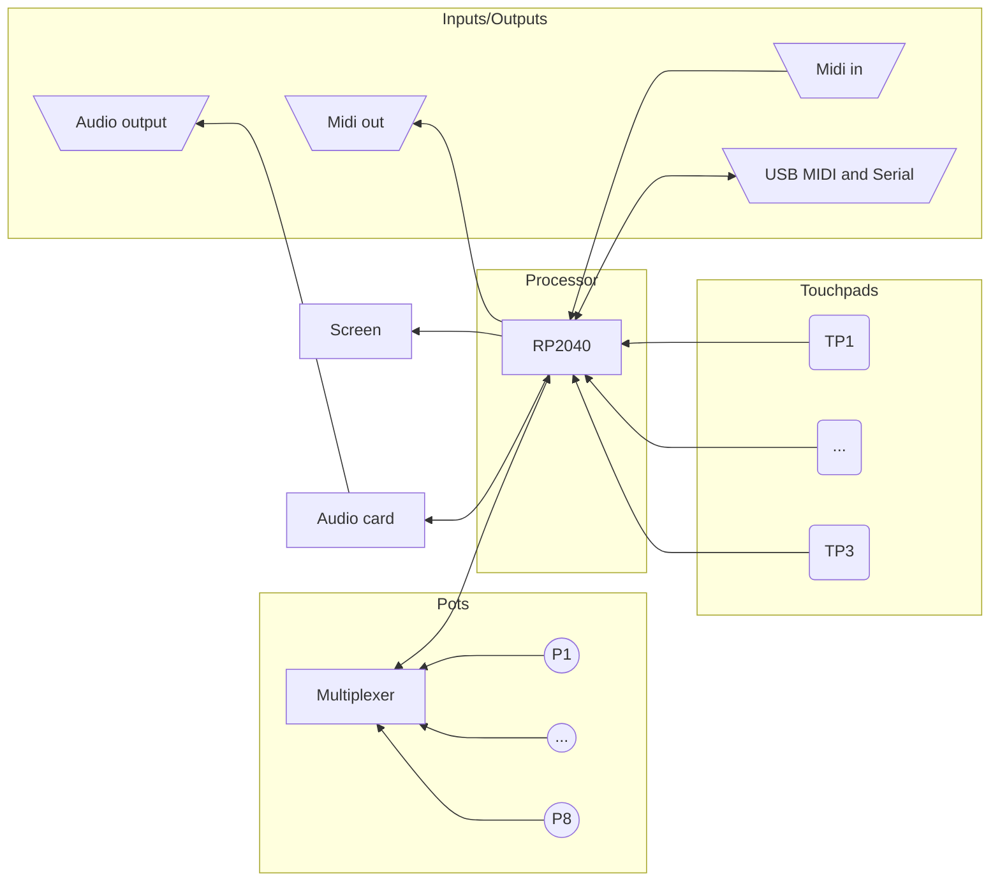

# EMMG 2024 Midi Workshop
---

## Organization

| Time        | Activity                             |
| ----------- | ------------------------------------ |
| 12:00-12:30 | Eat and socialize                    |
| 12:30-13:00 | Introduction to Midi and controllers |
| 13:00-13:30 | Play with the device: full program   |
| 13:30-13:45 | Group activity                       |
| 13:45-14:00 | How this device was designed         |
| 14:00-14:30 | Where to go next and questions       |
| 14:30-???   | Free time                            |
 

---

## What MIDI is

MIDI stands for **Musical Instrument Digital Interface**

---

## History: 850 to 1850


![[Pasted image 20240923203944.png]]
<div class="small">

https://midi.org/the-history-of-midi

</div>
---
## History: 1850 - 1930

<split even>
<div>
![[Pasted image 20240923204416.png]]
<div class="small">

https://midi.org/the-history-of-midi

</div>
</div>
<div>
![[Pasted image 20240923204346.png]]

<div class="small">

[Westworld](https://www.imdb.com/title/tt0475784/)

</div>
</div>
</split>
---

## History: 1900s

<iframe width="560" height="315" src="https://www.youtube.com/embed/8WoNlMsFF60?si=e7uCmdLFUUoqapwg" title="YouTube video player" frameborder="0" allow="accelerometer; autoplay; clipboard-write; encrypted-media; gyroscope; picture-in-picture; web-share" referrerpolicy="strict-origin-when-cross-origin" allowfullscreen></iframe>

---
<split even>
<div>
![[Pasted image 20240923210026.png]]
<div class="small">

[Washington Post - Wendy Carlos](https://www.washingtonpost.com/outlook/wendy-carlos-the-electronic-music-pioneer-who-happens-to-be-transgender/2020/10/22/fa4f511e-d5ac-11ea-930e-d88518c57dcc_story.html)

</div>
</div>
<div>
![[Pasted image 20240923210236.png]]
<div class="small">

https://midi.org/the-history-of-midi

</div>

</div>
</split>
---

## Physical

<grid drag="85 85" drop="center">
![[Pasted image 20240922131821.png]]
</grid>
<grid drag="90 40" drop="5 80">
<div class="small">

[By :en:Pretzelpaws CC BY-SA 3.0](https://commons.wikimedia.org/w/index.php?curid=142551)

</div>
</grid>
---


![[Pasted image 20240922132050.png]]

<grid drag="90 40" drop="5 80">
<div class="small">

[v., CC BY-SA 4.0](https://commons.wikimedia.org/w/index.php?curid=36160510)

</div>
</grid>

---
<div class="small">


```shell
 
----|---|--\
    |   |   >
----|---|--/
  S   R   T
 
```

| TRS | Type B | Type A TRS (MIDI 2.0) | Type C TS only |
| --- | ------ | --------------------- | -------------- |
| S   | Shield | Shield                | Sink           |
| R   | Sink   | Source                | Sink           |
| T   | Source | Sink                  | Source         |

- Type A (The MIDI norm) Korg, Akai
- Type B Arturia, Old Novation devices (all new Novation devices like the MK3 series are on Type A)

</div>

---

<div class="small">


```shell
                       Female plug seen from the pin sides
                                       2
                                       o 
                                   4 o   o 5 
                                  1 o     o 3
                                 
                                 
                                   Male plug
                                       2
                                       o 
                                   5 o   o 4 
                                  3 o     o 1
                                 
```

| DIN | Function |
|-----|----------|
| 2   | Shield   |
| 5   | Source   |
| 4   | Sink     |

</div>

---

## Electrical 
![[shieldec_cable_wikipedia.png]]

<grid drag="90 40" drop="5 80">
<div class="small">

[source Wikipedia Em3rgent0rdr]( https://en.wikipedia.org/wiki/MIDI)

</div>
</grid>

---

## Logical

31250 bps - 8-N-1

![[MIDI_byte.svg]]
![[MIDI_packets.svg#3]]


---

Hexadecimal is practical to talk about status bytes
<div class="small">

| Hexa | Binary | Decimal |
| ---- | ------ | ------- |
| 0x0  | 0000   | 0       |
| 0x1  | 0001   | 1       |
| 0x2  | 0010   | 2       |
| 0x3  | 0011   | 3       |
| 0x4  | 0100   | 4       |
| 0x5  | 0101   | 5       |
| 0x6  | 0110   | 6       |
| 0x7  | 0111   | 7       |
| 0x8  | 1000   | 8       |
| 0x9  | 1001   | 9       |
| 0xA  | 1010   | 10      |
| 0xB  | 1011   | 11      |
| 0xC  | 1100   | 12      |
| 0xD  | 1101   | 13      |
| 0xE  | 1110   | 14      |
| 0xF  | 1111   | 15      |

</div>

---


![[MIDI_packets.svg#3]]
<div class="small">

Status byte is split in two parts:
- message type (4 bits, 3 usable) 
- channel (4 bits)

| Hexa | Binary | Message type                                               | Data 1         | Data 2   |
| ---- | ------ | ---------------------------------------------------------- | -------------- | -------- |
| 0x8n | 1000   | Note Off                                                   | Note           | Velocity |
| 0x9n | 1001   | Note On                                                    | Note           | Velocity |
| 0xAn | 1010   | Polyphonic Aftertouch                                      | Note           | Pressure |
| 0xBn | 1011   | Control Change                                             | Control Number | Value    |
| 0xCn | 1100   | Program Change                                             | Program Number | -        |
| 0xDn | 1101   | Channel Aftertouch                                         | Pressure       | -        |
| 0xEn | 1110   | Pitch Wheel                                                | LSB            | MSB      |
| 0xFn | 1111   | Song position/options<br>System exclusive (large messages) |                |          |

LSB: Least Significant Bits - MSB: Most Significant Bits

</div>

---

## Parsing midi

<grid drag="90 30" drop="5 40">
<div class="small">

![[Pasted image 20240903220644.png]]
</div>
</grid>

---

![[Pasted image 20240903220905.png]]
(source unknown, if you find it I would like to know)

---

## Controllers

<div class="small">

- Send notes (Note ON/OFF with velocity)
- CC (values from 0 to 127)
- (N)RPN (Non-) registered parameters numbers
    - CC 101 (RPN) or 99 (NRPN) - MSB parameter
    - CC 100 (RPN) or 98 (NRPN) - LSB parameter
    - CC 6 - value MSB
    - CC 38 (optional) - value LSB (fine)
    - 16k parameters with values from 0 to 16383
    - We often send CC 101 - 127 followed by CC 100 - 127, the NULL RPN to say the parameter is done (or cancel a previous one)

</div>

TL;DR :
Notes, controls 0-127 or 0-16384

(we will ignore clock and time for today)

---

<grid drag="40 40" drop="0 0">
![[Pasted image 20240923212928.png]]
<div class="small">

[Wikipedia](https://en.wikipedia.org/wiki/MIDI_controller#/media/File:Roland_AX-1_keytar_midi_controller.JPG)
</div>
</grid>
<grid drag="40 40" drop="50 0">
![[Pasted image 20240923213037.png]]
<div class="small">

[Wikipedia](https://en.wikipedia.org/wiki/MIDI_controller#/media/File:Roland_Octapad_II_Pad-80.jpg)
</div>
</grid>
<grid drag="40 40" drop="0 50">
![[Pasted image 20240923213216.png]]
<div class="small">

[Wikipedia](https://en.wikipedia.org/wiki/MIDI_controller#/media/File:Remote_25.jpg)
</div>
</grid>
<grid drag="40 40" drop="50 50">
![[Pasted image 20240923213238.png]]
<div class="small">

[Wikipedia](https://en.wikipedia.org/wiki/MIDI_controller#/media/File:Onyx_The_Digital_Pied_Piper.jpg)
</div>
</grid>

---

<grid drag="40 40" drop="0 0">

![[Pasted image 20240923213746.png]]

<div class="small">

[Imogen Heap and mi.mu gloves](https://www.synthtopia.com/content/2014/04/04/imogen-heap-demos-her-midi-gloves/)
</div>
</grid>


<grid drag="40 40" drop="40 0">
![[Pasted image 20240923214006.png]]
<div class="small">

[Z7S](https://www.starrlabs.com/product/z7s/)
</div>
</grid>


<grid drag="40 40" drop="0 50">
![[Pasted image 20240923214342.png]]

<div class="small">

[Onyx Ashanti - Beatjazz controller](https://makezine.com/projects/beatjazz-controller/) - 
[Onyx Ashanty - Ted talk](https://www.ted.com/talks/onyx_ashanti_this_is_beatjazz?subtitle=en)
</div>
</grid>

<grid drag="40 40" drop="40 50">
![[Pasted image 20240923215233.png]]

<div class="small">

[Penny Pad](https://www.dancemusicnw.com/penny-pad-pennywild-dance-pad-midi-controller/)
</div>
</grid>

---

## Play with the device

<grid drag="100 100" drop="center">

![[working_device_and_boards_tested.jpg]]
</grid>

---

## Group activity

---

## The device


<grid drag="100 100" drop="center">

![[working_device_and_boards_tested.jpg]]
</grid>

---

![[Pasted image 20240903202950.png]]

---

<grid drag="100 100" drop="center">



</grid>

---

## RP2040


<grid drag="80 80" drop="0 20">

![[Pasted image 20240922145416.png]]


<div class="small"> 

[RP2040 Datasheet](https://datasheets.raspberrypi.com/rp2040/rp2040-datasheet.pdf)
</div>

</grid>
---

## Analog pots


<grid drag="80 80" drop="0 20">

![[Pasted image 20240922150849.png]]

<div class="small">

[By Junkyardsparkle - Wikipedia](https://en.wikipedia.org/wiki/Potentiometer#/media/File:Single-turn_potentiometer_with_internals_exposed,_oblique_view.jpg)

</div>
</grid>

---


<grid drag="100 60" drop="center">

![[Pasted image 20240922151122.png]]

$V_{out} = \frac{Z_2}{Z_1+Z_2} \cdot V_{in}$

<div class="small">

[Source velociostrich Wikipedia](https://en.wikipedia.org/wiki/Voltage_divider#/media/File:Impedance_voltage_divider.svg)

</div>

</grid>

---

## Multiplexing: more IOs

<grid drag="100 100" drop="center">
![[flow_road.svg]]
</grid>

---

<grid drag="100 100" drop="center">
![[Pasted image 20240922145650.png]]
<div class="small">

[Wikipedia CaesarIII](https://en.wikipedia.org/wiki/Multiplexer#/media/File:Multiplexer2.svg)

</div>
</grid>

---


<grid drag="100 100" drop="center">

![[Pasted image 20240922150615.png]]

<div class="small">

[TI Datasheet 74HC4051](https://www.ti.com/lit/ds/symlink/cd74hc4051-ep.pdf)

</div>
</grid>

---


## GPIOs


<grid drag="100 100" drop="center">

![[Pasted image 20240922160554.png]]

<div class="small">

[RP2040 Datasheet](https://datasheets.raspberrypi.com/rp2040/rp2040-datasheet.pdf)

</div>
</grid>
---

## Capacitive sensing


$$V_c(t) = V_0 + (V_f - V_0)(1 - e^{-t/\tau})$$

For discharging:

$$V_d(t) = V_0 \cdot e^{-t/\tau}$$

<div class="small">


- $V_c(t)$ is the voltage during charging at time $t$
- $V_d(t)$ is the voltage during discharging at time $t$
- $V_0$ is the initial voltage
- $V_f$ is the final (full) voltage for charging (usually the supply voltage)
- $t$ is the time
- $\tau$ (tau) is the time constant, equal to $RC$ where $R$ is the resistance and $C$ is the capacitance

</div>
---

<grid drag="100 100" drop="center">

![[cap_sense.svg]]

</grid>
---

![[Pasted image 20240922154646.png]]

---

![[Pasted image 20240922155551.png]]

<div class="small">

Yellow is the transition zone for the GPIO

</div>

---

## CircuitPython playground

---

## C++

Setting up in the Arduino IDE:

Open up the Arduino IDE and go to File->Preferences.

In the dialog that pops up, enter the following URL in the "Additional Boards Manager URLs" field:

[https://github.com/earlephilhower/arduino-pico/releases/download/global/package_rp2040_index.json](https://github.com/earlephilhower/arduino-pico/releases/download/global/package_rp2040_index.json)


![[Pasted image 20240928122416.png]]

---

## How the device was made

![[Pasted image 20240923220353.png]]

---

![[Pasted image 20240923220430.png]]

https://www.kicad.org/


---

![[Pasted image 20240923220440.png]]


---

![[Pasted image 20240923220458.png]]

https://www.kicad.org/

---


<grid drag="50 50" drop="0 0">
![[Pasted image 20240923220519.png]]
</grid>

<grid drag="50 50" drop="50 0">
![[Pasted image 20240923220552.png]]
</grid>

<grid drag="50 50" drop="0 50">
![[Pasted image 20240923220600.png]]
</grid>

<grid drag="50 50" drop="50 50">
![[Pasted image 20240923220612.png]]
</grid>

https://openscad.org/

---

## Inspiration


<grid drag="100 100" drop="center">
![[Pasted image 20240922165719.png]]
<div class="small">

[Picoslidertoy on Tindie](https://www.tindie.com/products/todbot/picoslidertoy-capsense-controller-for-pico/)

</div>
</grid>

---


<grid drag="100 100" drop="center">

![[Pasted image 20240922165839.png]]

<div class="small">

[Pico test synth on Tindie](https://www.tindie.com/products/todbot/pico_test_synth/)

</div>
</grid>

---

## JLCPCB


https://jlcpcb.com/

---

## Cost breakdown

<split even>
<div class="small">

Final run:

- JLCPCB Boards : $158.89 for 20
- Addons: $254.94 for 20
- Headers: $20 for 20
- Jacks: free (from PS1)

</div>

<div class="small">

Development costs:

- $65 (jlcpcb)
- $51 (screens+i2s+pots)
- $44 (picos)

Total cost of development:
$160

</div>
</split>

Per board:
- $22 / board
- $8 / support for development
- $5 / support for PS1 electronics lab

---

## Next steps
- CPU v2 : The RP2350 - yes but no
- Share your code and changes
[Github workshop](https://github.com/bjonnh/2024_emmg_workshop_midi)

- Velocity sensitive pads
[Handcrafting sensors](https://cdn-shop.adafruit.com/datasheets/HandcraftingSensors.pdf)

- Prototyping: 

[Adafruit](https://www.adafruit.com/)
can be found often at Microcenter as well.

---

## Similar things


<grid drag="100 100" drop="center">
<iframe width="560" height="315" src="https://www.youtube.com/embed/AVurAVEAFNo?si=gXB9GJ0Xwgc_kRHb" title="YouTube video player" frameborder="0" allow="accelerometer; autoplay; clipboard-write; encrypted-media; gyroscope; picture-in-picture; web-share" referrerpolicy="strict-origin-when-cross-origin" allowfullscreen></iframe>
<div class="small">

$149 - Code is Open Source (MIT)
 [Zeptocore](https://zeptocore.com/)
</div>
</grid>

---


<grid drag="100 100" drop="center">

![[Pasted image 20240922170601.png]]

<div class="small">


$90 - Code is Open Source (MIT) could run on this platform

[Picocore](https://infinitedigits.co/wares/pikocore/)

</div>
</grid>

---
- MIDI controller libraries

C++/Arduino: https://github.com/tttapa/Control-Surface
<div class="small">

Good if you want to make just a controller, abstracts much of the pain away.
</div>

```
#include <Control_Surface.h>

USBMIDI_Interface midi;
CCPotentiometer pot { A0, MIDI_CC::General_Purpose_Controller_1 };

void setup() { Control_Surface.begin(); }
void loop() { Control_Surface.loop(); }
```
---

<grid drag="100 100" drop="center">

<div class="small">

```cpp
#include <Control_Surface.h>  // Include the library
 
USBMIDI_Interface midi;  // Instantiate a MIDI Interface to use
 
// Instantiate an analog multiplexer
CD74HC4051 mux {
  A0,       // Analog input pin
  {3, 4, 5} // Address pins S0, S1, S2
};
 
// Create an array of CCPotentiometer objects that send out MIDI Control Change 
// messages when you turn the potentiometers connected to the 8 inputs of the mux.
CCPotentiometer volumePotentiometers[] {
  { mux.pin(0), { MIDI_CC::Channel_Volume, Channel_1 } },
  { mux.pin(1), { MIDI_CC::Channel_Volume, Channel_2 } },
  { mux.pin(2), { MIDI_CC::Channel_Volume, Channel_3 } },
  { mux.pin(3), { MIDI_CC::Channel_Volume, Channel_4 } },
  { mux.pin(4), { MIDI_CC::Channel_Volume, Channel_5 } },
  { mux.pin(5), { MIDI_CC::Channel_Volume, Channel_6 } },
  { mux.pin(6), { MIDI_CC::Channel_Volume, Channel_7 } },
  { mux.pin(7), { MIDI_CC::Channel_Volume, Channel_8 } },
};
 
void setup() {
  Control_Surface.begin();  // Initialize the Control Surface
}

void loop() {
  Control_Surface.loop();  // Update the Control Surface
}
```

</div>

</grid>
---

## Take home messages
- Doing electronics is easy : break it down in tiny parts
- It has never been easier
 
---